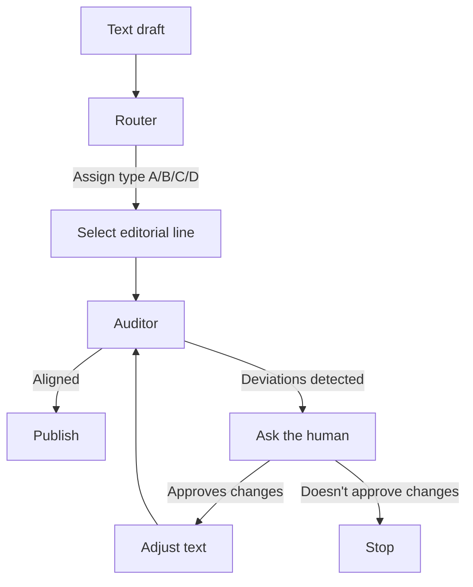

# Editorial Architecture Lab

A modular editorial system designed to classify, audit, and evolve long-form content using architectural principles rather than stylistic optimization.

---

## Origin

This system emerged during the development of **InBloom**, a content and applied AI blog focused on behavioral analysis, decision-making, and editorial clarity.

While producing long-form posts, a recurring tension appeared:

- The same structural intention could drift across pieces.
- Narrative and experimental formats were blending unintentionally.
- Editorial rigor depended too much on subjective review.

The question became structural rather than stylistic:

> Can editorial coherence be treated as an architectural problem?

This lab is the answer to that question.

It formalizes editorial intent, separates classification from evaluation, and introduces structural auditing without rewriting the author’s voice.

---

## Core idea

Writing is treated as an architectural artifact.

Each piece belongs to a structural category (A/B/C/D).  
Each category has operational rules and a Definition of Done.  
Each text is classified before being audited.

The goal is not better writing.

The goal is structural integrity.

---

## What this is NOT

This system is not:

- A writing assistant.
- A style improver.
- An engagement optimizer.
- A grammar checker.
- A content generator.
- A replacement for editorial judgment.

It does not attempt to rewrite, embellish, or maximize reach.

It evaluates structural coherence against declared intent.

Nothing more.

---

## Implementation (Current)

The system is currently implemented as **two Custom GPTs**:

- **Router (Custom GPT):** assigns the editorial type (A/B/C/D) with confidence.
- **Auditor (Custom GPT):** validates structural coherence against the selected type and reports only deviations.

The files in `/prompts` are the **instruction sets** used to configure those Custom GPTs.

The file in `/editorial_framework` includes the required **editorial lines** for context.

**Editorial lines**: 

- **Type A** — Applied, non-technical, product-oriented  
- **Type B** — Technical applied explanation  
- **Type C** — Reflective / conceptual tension  
- **Type D** — Laboratory / experiment  

Each type includes:

- Operational rules  
- Definition of Done  

---

## Workflow

---

## Current version

v2.0 Router + Auditor active

---

## Future Directions

* Automated workflow orchestration
* Structured logging of revisions
* Versioned editorial decisions
* Cross-domain adaptation beyond blog writing

---

## Status

* Experimental.
* Used in real editorial production.
* Continuously iterated.